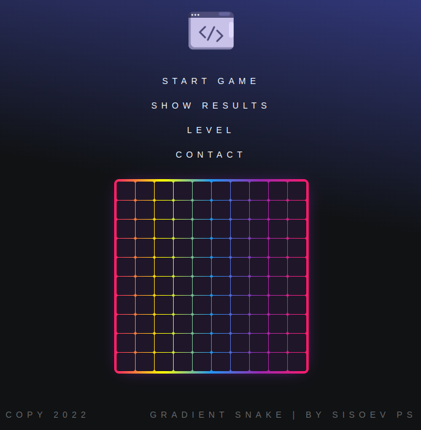

# SnakeJS
mini game Snake on JavaScript

Проект выполнен в соответствии с функциональными требованиями
- запуск игры осуществляется кликом по игровому поля либо по кнопке в меню `start game`
- текущая статистика и лучший результат игрова доступны в любой момент игры во вкладке `show results`
- сложность игры можно выбрать во вкладке `level` в меню
- кнопка `new game` появляется после завершения текущей игры 

Также реализованы дополнительные задания:

- изменение размера игрового поля в соответствии с уровнем игры
- на уровне сложности HARD если змейка врезается в поле - конец игры
- на всех уровнях сложности скорость змейки отличается

